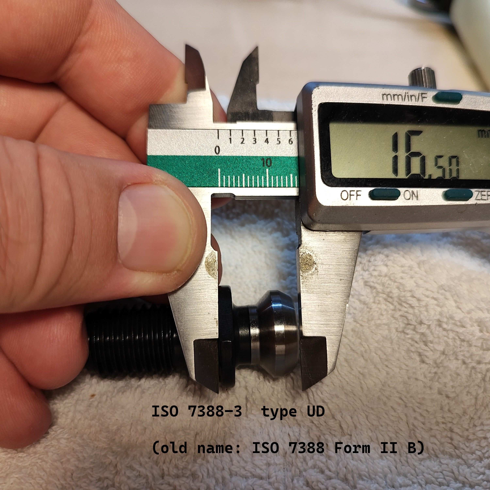
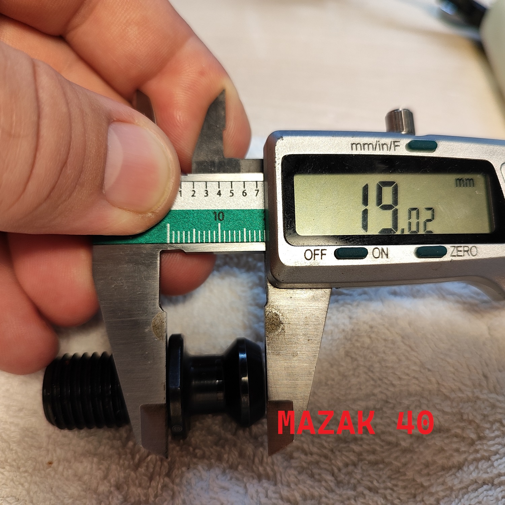

# Maho MH500w CNC

Documentation and notes for a Maho MH500W CNC

## Selecting Heidenhain EXE (converters for 

LS-403C has a grating period of 20μm ==> 1 μm resolution in 5 fold interpolation

# Linux CNC Installation

# Software Installation

Start of `bookworm/sid` (use xfce):

https://cdimage.debian.org/cdimage/unofficial/non-free/cd-including-firmware/

- Remove cdrom from sources: sudo nano /etc/sources.list
- `sudo apt install ethtool`

Check driver alignment:

- `lspci`
- `sudo ethtool -i enp2s0`

## Install Rods' custom kernel

6.1 exists in my NAS

- install headers
- install kernel
- `sudo apt install grub-customizer`
- `sudo apt install r8168-dkms`

# Mesa 7i97


## Network interface:

`sudo vim /etc/network/interfaces`

```
auto enp2s0
iface enp2s0 inet static
address 10.10.10.1 or 192.168.1.1
```
Restart network: `sudo systemctl restart networking`


`mesaflash --device 7i97 --addr 10.10.10.10 --readhmid`

# ??? sudo ethtool -C eth0 rx-usecs 0

# LinuxCNC


`sudo apt install linuxcnc-uspace linuxcnc-uspace-dev mesaflash`


Let it run for a while. While it is running,
in another window, check the network latency by reviewing the TMAX settings on your card

`halcmd show param hm2*tmax*`

```
Parameters:
Owner   Type  Dir         Value  Name
     7  s32   RW              0  hm2_7i97.0.read-request.tmax
     7  bit   RO          FALSE  hm2_7i97.0.read-request.tmax-increased
     7  s32   RW         704022  hm2_7i97.0.read.tmax
     7  bit   RO          FALSE  hm2_7i97.0.read.tmax-increased
     7  s32   RW          42126  hm2_7i97.0.write.tmax
     7  bit   RO          FALSE  hm2_7i97.0.write.tmax-increased
```


# Notes

[Enable outputs](https://forum.linuxcnc.org/27-driver-boards/46253-mesa-7i97-analog-out-issue#246257)


# Notes

- MAHO Original color: RAL6011

## Pull Stud

- SK40 ISO 7388 II B
  - The short pull stud for SK
  - The long for BT 






ISO Standard: https://www.iso.org/standard/68845.html

What fits to a CAT40 cone:
    Pull studs ISO 7388-3 Form UD | M16 | former norm ISO 7388 Form II B (https://bit.ly/38K9Pz4)
    Kemmler
        Order number: 404.20.16
        https://www.kemmler-shop.de/en/pull-studs/pull-studs-iso-7388/1509/pull-studs-iso-7388-3-form-ud-m16-with-drill-through-without-o-ring?c=1099


What fits to a BT40 cone:
    Longer by 3mm.
    Kemmler:
        Order number: 404.20.16.20
        https://www.kemmler-shop.de/en/pull-studs/pull-studs-iso-7388/1511/pull-studs-iso-7388-3-form-ud-m16-with-drill-through-incl.-o-ring?c=1099


# Gallery


